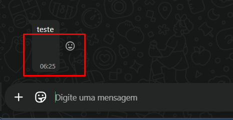
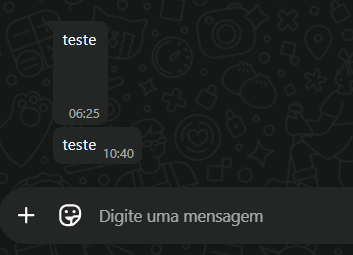

# Chatwoot Intermediary Cleaner

Webhook intermediário que limpa espaços extras e quebras de linha das mensagens enviadas pelo **Chatwoot** antes de encaminhá-las para a **Evolution API**, garantindo que as mensagens cheguem limpas no WhatsApp.

## O problema

Ao integrar Chatwoot + Evolution API + WhatsApp, as mensagens enviadas pelos atendentes chegavam com espaços e quebras de linha extras no final:

| Antes | Depois |
|-------|--------|
|  |  |

As mensagens chegavam com linhas em branco visíveis abaixo do texto.

## A solução

Um serviço Go leve que atua como proxy transparente entre o Chatwoot e a Evolution API:

```
Chatwoot → msg-cleaner → Evolution API → WhatsApp
```

O intermediário:
- Recebe o webhook do Chatwoot
- Limpa o campo `content` com `strings.TrimSpace()` (remove espaços, `\n`, `\r` no início e fim)
- Encaminha o payload limpo para a Evolution API no mesmo path/endpoint
- Preserva todos os headers originais da requisição

## Pré-requisitos

- Docker e Docker Compose
- Chatwoot e Evolution API já rodando na mesma rede Docker externa (`chat-bridge` ou equivalente)

## Instalação

**1. Clone o repositório:**

```bash
git clone https://github.com/seu-usuario/chatwoot-intermediary-cleaner.git
cd chatwoot-intermediary-cleaner
```

**2. Configure o `.env`:**

```bash
cp .env.example .env
```

Edite o `.env` conforme seu ambiente:

```env
# URL interna da Evolution API (nome do container na rede Docker)
EVOLUTION_API_URL=http://evolution_api:8080

# Porta em que o intermediário vai escutar
PORT=8081
```

**3. Suba o container:**

```bash
docker compose up -d --build
```

**4. Verifique se está na rede correta:**

```bash
docker network inspect chat-bridge | grep msg-cleaner
```

## Configuração no Chatwoot

Acesse **Settings → Inboxes → [sua inbox do WhatsApp] → Settings → Configuration**.

Altere o campo **Webhook URL** de:

```
http://evolution_api:8080/chatwoot/webhook/NOME_DA_INSTANCIA
```

Para:

```
http://msg-cleaner:8081/chatwoot/webhook/NOME_DA_INSTANCIA
```

> Substitua `NOME_DA_INSTANCIA` pelo nome da sua instância na Evolution API.

## Estrutura do projeto

```
.
├── main.go              # Servidor proxy com limpeza de mensagens
├── go.mod               # Módulo Go (sem dependências externas)
├── Dockerfile           # Build multi-stage (imagem final ~10MB)
├── docker-compose.yml   # Serviço Docker com rede chat-bridge
├── .env                 # Configurações locais (não commitar)
├── .env.example         # Modelo de configuração
└── docs/
    ├── before.png       # Screenshot: mensagem com problema
    └── after.png        # Screenshot: mensagem limpa
```

## Monitorando os logs

```bash
docker logs msg-cleaner -f
```

Exemplo de saída ao limpar uma mensagem:

```
Intermediário rodando em :8081 → Evolution API: http://evolution_api:8080
Content limpo: "Olá, tudo bem?\n\n  " → "Olá, tudo bem?"
[200] /chatwoot/webhook/suporte → http://evolution_api:8080/chatwoot/webhook/suporte
```

## Variáveis de ambiente

| Variável            | Padrão                        | Descrição                                    |
|---------------------|-------------------------------|----------------------------------------------|
| `EVOLUTION_API_URL` | `http://evolution_api:8080`   | URL base da Evolution API na rede Docker     |
| `PORT`              | `8081`                        | Porta em que o intermediário escuta          |

## Docker Compose de referência

O `docker-compose.yml` deste projeto assume que existe uma rede Docker externa chamada `chat-bridge`, compartilhada com os containers do Chatwoot e da Evolution API.

Se sua rede tiver outro nome, ajuste em `docker-compose.yml` e no `.env`:

```yaml
networks:
  chat-bridge:      # ← altere aqui
    external: true
```

## Compatibilidade

Testado com:
- [Chatwoot](https://www.chatwoot.com/) `latest`
- [Evolution API](https://github.com/EvolutionAPI/evolution-api) `latest`
- Go `1.22`

## Licença

MIT
